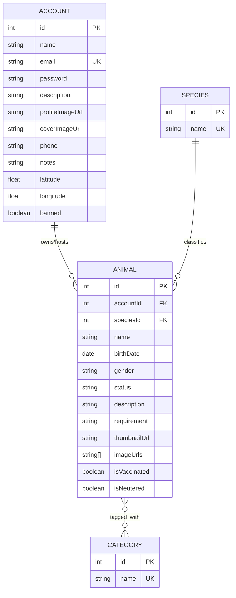

```mermaid
erDiagram
    ACCOUNT ||--o{ ANIMAL : "owns/hosts"
    SPECIES ||--o{ ANIMAL : "classifies"
    ANIMAL }o--o{ CATEGORY : "tagged_with"

    ACCOUNT {
        int id PK
        string name
        string email UK
        string password
        string description
        string profileImageUrl
        string coverImageUrl
        string phone
        string notes
        float latitude
        float longitude
        boolean banned
    }

    ANIMAL {
        int id PK
        int accountId FK
        int speciesId FK
        string name
        date birthDate
        string gender
        string status
        string description
        string requirement
        string thumbnailUrl
        string[] imageUrls
        boolean isVaccinated
        boolean isNeutered
    }

    CATEGORY {
        int id PK
        string name UK
    }

    SPECIES {
        int id PK
        string name UK
    }
```
